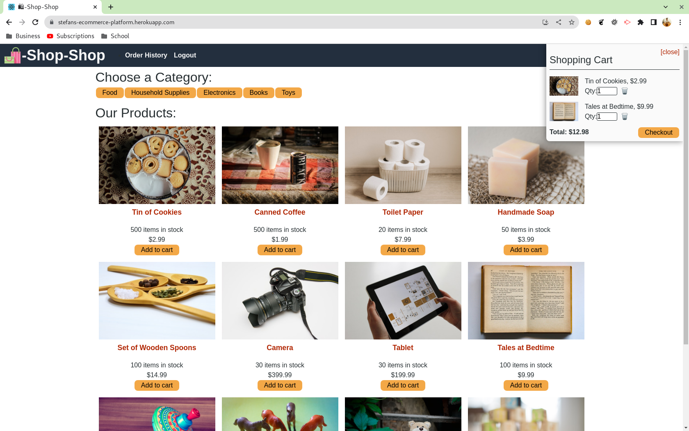
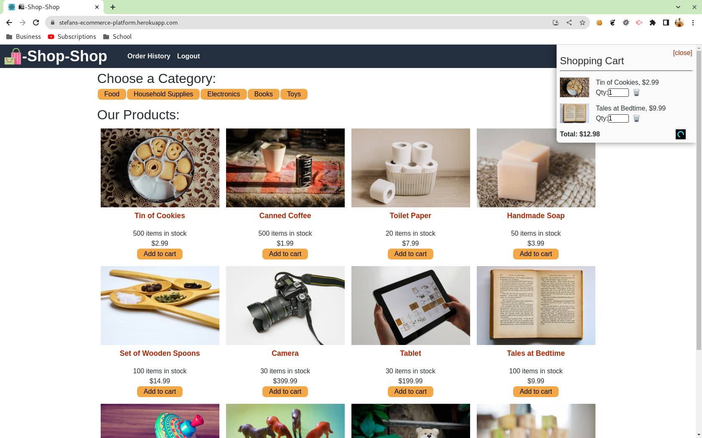
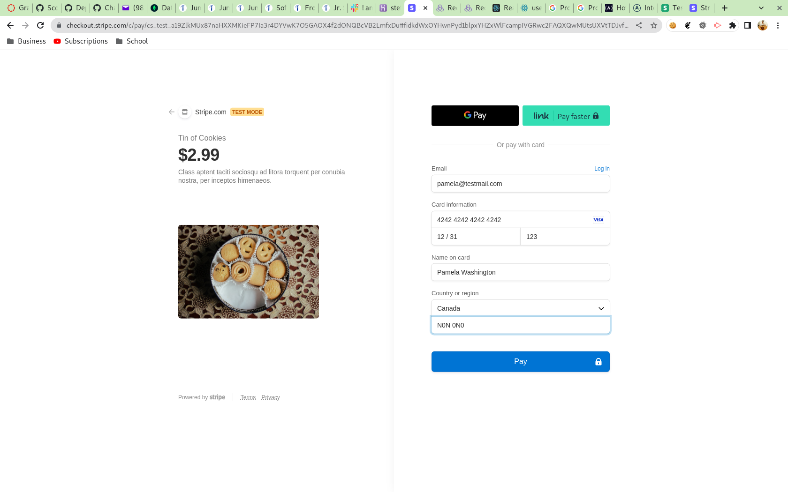
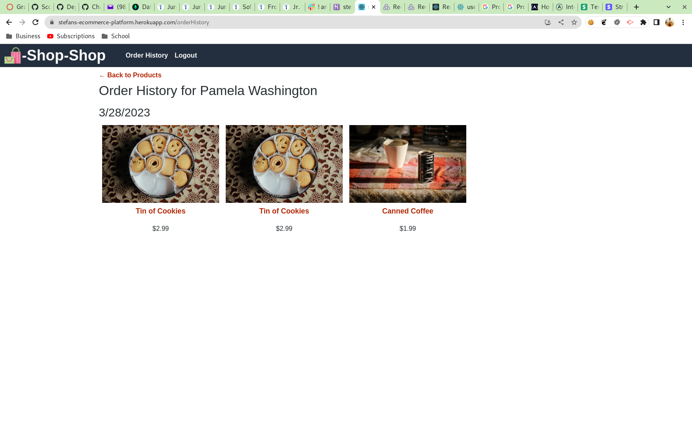

# UTOR-MOD22-CHAL01-eCommerce-Platform
University of Toronto - Module 22 - Challenge 01 - eCommerce Platform

## Description

Repository containing the code for the eCommerce platform application. This is a full MERN stack application where the Global state management has been moved to Redux. Redux is one of the popular state management libraries that provide "a predictable state container designed to help you write JavaScript apps that behave consistently across client, server, and native environments, and are easy to test. While it's mostly used as a state management tool with React, you can use it with any other JavaScript framework or library." For more information please visit https://redux.js.org/

The application has been refactored with the React-Redux package which is Redux's official package that lets  React components interact with a Redux store by reading pieces of state and dispatching actions to update the store. However, Redux is recommending and promoting their Redux Toolkit package; as such some of the methods in the React-Redux package are being deprecated (but not defunct yet). A good example is the createStore method, which is the main method to initialize the state in React-Redux. In future iterations, the app will be moved to the React Toolkit.

Nevertheless, the application functions with the React-Redux and everything that was present in the ```/utils/GlobalState.js``` (the actual file and any references to it) have been removed in favour of importing the useSelector and useDispatch hooks from react redux. A new file ```/utils/store.js``` has been created that initialised the global store and along with the react-redux's Provider have been imported in the ```App.js```. 

Below is a listing of files where changes have been made:
```md
/components/Cart/index.js
/components/CartItem/index.js
/components/CategoryMenu/index.js
/components/ProductItem/index.js
/components/ProductList/index.js

/pages/Detail.js```


In addition to that, a new minor change has been made to the checkout. The Checkout button appears on the cart once the user clicks on the shopping cart icon on the top right corner. Once the user clicks on the checkout, the user is redirected to Strip test region. However, there is a few seconds delay between the click of the button and the actual redirect. During those seconds, the user does not get any notification that something is happening.

To better the user experience, once the user clicks on the checkout button, the button is replaced with a small spinner to give the user a visual that request is being processed and a few moments will pass.


NOTE: because this application uses the stipe test region and doesn't have third party SSL certificates, you will likely see "Safe Browsing" message form google. To proceed back to the site, click on the "more details" and then look for "continue to site" as part of the verbiage that Google provides.

Below is the image of the eCommerce Platform when user is not logged in.


Below is the image of the eCommerce Platform when user is logged in.


Below is the image of the updated checkout functionality


Below is the image of the Stripe payment


Below is the image of the previous orders



## Table of Contents

- [Installation](#installation)
- [Functionality](#functionality)
- [Usage](#usage)
- [Credits](#credits)
- [Tests](#tests)
- [License](#license)
- [Walktrough](#walkthrough)
- [Future Development](#future-development)
- [Contact](#contact)

## Installation

No special installation requirements. Simply visit https://stefans-ecommerce-platform.herokuapp.com/ to use the application.


back to [Table of Contents](#table-of-contents)


## Functionality

The following discusses at a high level about some of the features of the website. Detailed code implementation can be found as comments in the JS files.


### Redux:

According to the official documentation at https://redux.js.org/ Redux:
- helps you write applications that behave consistently, run in different environments (client, server, and native), and are easy to test.
- centralizes the application's state and logic enables powerful capabilities like undo/redo, state persistence, and much more.
- provides DevTools to make it easy to trace when, where, why, and how your application's state changed. Redux's architecture lets you log changes, use "time-travel debugging", and even send complete error reports to a server.
- works with any UI layer, and has a large ecosystem of addons to fit your needs. 


back to [Table of Contents](#table-of-contents)

## Usage

To access application
1. Go to https://stefans-ecommerce-platform.herokuapp.com/ to access the application
2. Before logging in/setting up an account
    1. Navigate through the products and categories
    2. Add products to your cart
    3. Click on the cart icon at the top right - you will see the message that you need to be logged in before checking out
2. Log in or create an account (top navigation menu)
    1. Click on the cart icon at the top right - you will see the checkout button
    2. Click on the checkout button, see the spinner, and you will be redirected to Stripe test
    3. Use 
        1. credit card: 4242 4242 4242 4242 
        2. expiry: any date after today's date
        3. any 3 digit CVV
    4. Place the order - once processed, you will be redirected back to the site
    5. You can view your past orders in the order history section


back to [Table of Contents](#table-of-contents)


## Credits
https://redux.js.org/ for information about their library and usage

back to [Table of Contents](#table-of-contents)


## Tests

All tests have been performed manually using Chrome.

back to [Table of Contents](#table-of-contents)


## License

Please refer to the LICENSE in the repo.

back to [Table of Contents](#table-of-contents)


## Walkthrough

No walkthrough video required

back to [Table of Contents](#table-of-contents)


## Future Development

Here are some of the items to be considered for future development.
1. Add a "store owner" section where the owner can 
    1. add/update/delete products from the catalog
    2. view new orders
    3. print shipping labels
    4. print reports
    5. set up sales tax calculator to add taxes on checkout


back to [Table of Contents](#table-of-contents)


## Contact
Stefan Marinov
stefan_marinov@rogers.com

back to [Table of Contents](#table-of-contents)